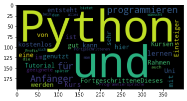
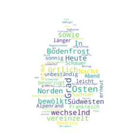

## Wordcloud

Quellen:  
https://www.python-lernen.de/wordcloud-erstellen-python.htm  
https://blog.goodaudience.com/how-to-generate-a-word-cloud-of-any-shape-in-python-7bce27a55f6e

Eine wordcloud stellt die Häufigkeit des Vorkommens von Wörtern in einem Text graphisch da. Je häufiger ein Wort vorkommt, desto größer erscheint es in der Grafik.

Um das Modul wordcloud benutzen zu können, muss zuerst die Bibliothek installiert werden.
Das geht mit dem Kommandozeilenbefehl:

```
pip install wordcloud
```

Mit dem folgenden Code lässt sich eine wordcloud erstellen:

* direkte Eingabe von Text

    * Importe:   
    ``` python
    from wordcloud import WordCloud
    import matplotlib.pyplot as plt
    ```
    * Text aus dem wordcloud erstellt werden soll:
    ```
    text = 'Python Kurs: mit Python programmieren lernen für Anfänger und Fortgeschrittene 
            Dieses Python Tutorial entsteht im Rahmen von Uni-Kursen und kann hier kostenlos genutzt werden.
            Python ist eine für Anfänger und Einsteiger sehr gut geeignete Programmiersprache, 
            die später auch den Fortgeschrittenen und Profis alles bietet, was man sich beim Programmieren wünscht.'
    ```
    * wordcloud erstellen 
    ```
    wordcloud = WordCloud().generate(text)
    plt.imshow(wordcloud, interpolation="bilinear")
    plt.show()
    ```

* .txt-Datei einlesen

    * Importe:
    ```
    from wordcloud import WordCloud, STOPWORDS
    import matplotlib.pyplot as plt
    import os
    ```
    * Text einlesen, aus dem wordcloud erstellt werden soll:
    ```
    d = os.path.dirname(__file__) if "__file__" in locals() else os.getcwd()
    
    with open("wordcloud-beispieltext.txt") as f:
        text = f.read()
    ```
    * wordcloud erstellen:
    ```
    wordcloud = WordCloud().generate(text)
    
    plt.imshow(wordcloud, interpolation="bilinear")
    plt.show()
    ```
  
    
    
* Design

    * Wörter ausschließen
        * Import erweitern auf
        ```
        from wordcloud import WordCloud, STOPWORDS
        ```
        * Liste nicht erwünschter Wörter anlegen
        ```
        nichtinteressant = "und von Der das den wir ist die auf im"
        liste_der_unerwuenschten_woerter = nichtinteressant.split()
        STOPWORDS.update(liste_der_unerwuenschten_woerter)
        ```
        * bei Erstellung der wordcloud angeben
        ```
        wordcloud = WordCloud(stopwords=STOPWORDS).generate(text)
        ```

    * Hintergrundfarbe ändern
    ```
    wordcloud = WordCloud(background_color="white").generate(text)
    ```

    * Ausgabegröße ändern
    ```
    wordcloud = WordCloud(width=1920, height=1080).generate(text)
    ```
  
    * Achse entfernen
    ```
  
    plt.axis("off")
    ```

    * maximale Schriftgröße
    ```
    wordcloud = WordCloud(max_font_size=100).generate(text)
    ```
    
    * Maske erstellen
        * anhand eines Links: 
        ```
        mask = np.array(Image.open(requests.get('http://www.clker.com/cliparts/O/i/x/Y/q/P/yellow-house-hi.png', stream=True).raw))
        wordcloud = WordCloud(mask=mask).generate(text)
        ```
        * anhand eines lokalen Bildes:
        ```
        mask = np.array(Image.open('Regentropfen.jpg'))
        wordcloud = Wordcloud(mask=mask).genearte(text)
        ```
    
        
